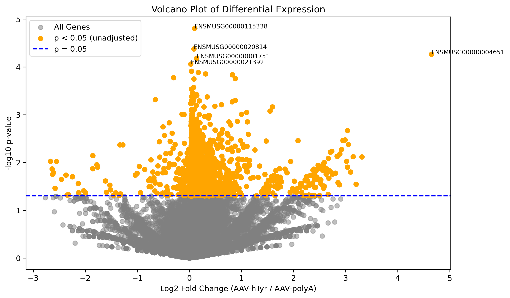

# RNA-Seq Analysis of Parkinson’s Disease Model (GSE243520)

## Overview
This project analyzes RNA-seq data from GEO dataset [GSE243520](https://www.ncbi.nlm.nih.gov/geo/query/acc.cgi?acc=GSE243520) to compare a new Parkinson’s disease model (`AAV-hTyr`, human Tyrosine Hydroxylase overexpression) against controls (`AAV-polyA`). The goal was to identify differentially expressed genes (DEGs) and explore genomic changes related to Parkinson’s disease.

## Methods
- Processed 6 mouse brain RNA-seq samples (3 control: GSM7789851-3, 3 PD: GSM7789854-6) from `.counts.txt` files.
- Filtered 36,207 genes to remove zeros, applied log2 normalization using Python (`pandas`, `numpy`).
- Generated boxplots and correlation heatmaps with `seaborn` to assess sample consistency.
- Performed t-tests (`scipy`) to compare groups, adjusted p-values with FDR (`statsmodels`).
- Created a volcano plot (`matplotlib`) to visualize DEGs.

## Results
- **Key Finding**: Identified 1,914 genes with raw p-values < 0.05, but none were FDR-significant (FDR < 0.05), indicating subtle transcriptomic effects due to small sample size (3 vs. 3).
- **Volcano Plot**: Showed most changes near zero fold change, with a flower-like shape.
  
- **Tyrosine Hydroxylase (Th)**: Slightly downregulated (log2FC = -0.075, p = 0.317), suggesting possible feedback regulation.
- **Top Genes**:
  | Gene ID               | Log2 Fold Change | p-value  |
  |-----------------------|------------------|----------|
  | ENSMUSG00000000078.8  | 0.039            | 0.0155   |
  | ENSMUSG00000000253.14 | 0.038            | 0.0256   |
  | ENSMUSG00000000275.17 | 0.133            | 0.0087   |
  | ENSMUSG00000000290.14 | 0.261            | 0.0198   |
  | ENSMUSG00000000317.12 | 0.284            | 0.0058   |

## Files
- `gse243520_analysis.ipynb`: Jupyter notebook with full analysis
- `volcano_plot.png`: Volcano plot of differential expression results.

## Skills Demonstrated
- **Programming**: Python (`pandas`, `numpy`, `scipy`, `seaborn`, `matplotlib`)
- **Bioinformatics**: RNA-seq data processing, differential expression analysis
- **Data Visualization**: Boxplots, heatmaps, volcano plots
- **Statistics**: T-tests, FDR correction

## Contact
Elliot (elliotyapliyu@gmail.com)

## Future Work
- Apply DESeq2 for more sensitive differential expression analysis.
- Perform pathway analysis on raw significant genes to explore dopamine-related pathways.